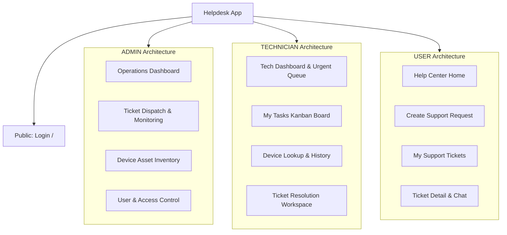

# 🎨 CS466 HELPDESK — TOÀN DIỆN KẾ HOẠCH REDESIGN FRONTEND (UI/UX & DESIGN SYSTEM)
> **Tài liệu đặc tả kiến trúc & thiết kế UI/UX dành cho CS466 Helpdesk / IT Service Management**  
> **Phiên bản:** 2.0-PROD  
> **Người thực hiện vai trò:** Senior Product Designer · Senior UI/UX Designer · Senior Frontend Architect · Design System Engineer  
> **Repository:** `https://github.com/Gnas260605/PY_BE.git`

---

## 1. EXECUTIVE SUMMARY

### 1.1. Hiện trạng Frontend
- **Frontend hiện tại** đã được chuyển đổi từ bản HTML/JS sơ khởi sang **Python NiceGUI 2.24.2** + Tailwind CSS utility / Quasar UI components, kết nối REST API tới FastAPI Backend (`http://127.0.0.1:8000/api`).
- **Khoảng cách cốt lõi (Gaps):**
  1. Các màn hình nghiệp vụ trọng yếu của Kỹ thuật viên (`/technician/tasks`, `/technician/devices`) và Người dùng (`/user/tickets`) thực chất vẫn đang gọi chung một view wrapper sơ cấp (`views/ticket_board.py`), chưa phân tách trải nghiệm chuyên biệt theo Role.
  2. Trang Chi tiết Ticket (`/tickets/{id}/history`) mới chỉ hiển thị danh sách dòng chữ lịch sử thô sơ, chưa có không gian làm việc tương tác (Workspace), thiếu hoàn toàn khu vực thảo luận hai chiều (`TICKET_COMMENTS`) dù Backend API đã hỗ trợ.
  3. Dashboard của cả 3 vai trò đang dùng chung một màn hình với 3-4 card số liệu tĩnh, thiếu biểu đồ phân tích chuyên sâu (ECharts) về phân loại sự cố, mức độ khẩn cấp và tiến độ xử lý.
  4. Giao diện có dấu hiệu lạm dụng Card lồng Card, border-radius quá lớn (20-30px), màu sắc gradient bóng bẩy kiểu demo ("AI-generated slop") thay vì phong cách Enterprise SaaS hiện đại, tối giản và hiệu quả cao (như Stripe, Linear, GitHub, Jira Service Management).

### 1.2. Mục tiêu Redesign
- **Xây dựng Design System chuẩn Enterprise Helpdesk:** Bảng màu Slate/Indigo/Emerald sắc nét, tỷ lệ tương phản đạt chuẩn WCAG AA, typography phân cấp rành mạch (`Plus Jakarta Sans`), spacing scale 4px–48px đồng nhất.
- **Phân tách trải nghiệm 3 Persona (RBAC):**
  - **Admin:** Bảng điều khiển vận hành, quản trị tài khoản, danh mục thiết bị, phân công kỹ thuật viên qua Data Table mạnh mẽ với bộ lọc đa tiêu chí và context menu.
  - **Technician:** Workspace tập trung vào năng suất ("What should I work on next?"), tích hợp Kanban Board 4 cột trực quan, tra cứu thiết bị và lịch sử sửa chữa kèm 1-click status transitions.
  - **User:** Portal hỗ trợ tối giản, thân thiện, tạo ticket chỉ trong 1-2 bước, theo dõi tiến độ ticket qua Timeline trực quan và trao đổi trực tiếp với kỹ thuật viên.
- **Bảo toàn 100% Backend Safety:** Không thay đổi API contract, database schema hay JWT auth format; tận dụng tối đa 19+ REST API có sẵn.

---

## 2. EXISTING FRONTEND ARCHITECTURE

```
frontend/
├── app.py                     # Entrypoint NiceGUI & Route definitions
├── requirements.txt           # nicegui==2.24.2, httpx, pydantic, python-dotenv
├── core/
│   ├── config.py              # Configuration & Environment loading
│   ├── auth_context.py        # Token storage in memory/app.storage.user
│   ├── cache.py               # Memory TTL Cache (30s) for API calls
│   ├── constants.py           # Enums (Role, Status, Priority, Category)
│   └── http_client.py         # Httpx Async Client, Token injection & Error parsing
├── common/
│   ├── styles/
│   │   ├── theme.py           # Quasar colors, Google Fonts, Global CSS rules
│   │   └── breakpoints.py     # Responsive CSS classes
│   ├── formatters.py          # format_datetime, truncate, badge formatting
│   ├── validators.py          # Email, password, required inputs
│   └── components/
│       ├── layout.py          # app_shell wrapper (Auth guard + Navbar + Sidebar)
│       ├── navbar.py          # Top header with initials avatar, title & logout
│       ├── sidebar.py         # Left drawer with role-based navigation links
│       ├── bottom_nav.py      # Mobile footer navigation
│       ├── stat_card.py       # Metric summary card
│       ├── status_badge.py    # Chip badges for status & priority
│       ├── responsive_card.py # Mobile fallback ticket card
│       ├── data_table.py      # Adaptive table with QTable / card switch
│       └── modal.py           # Confirm dialog utility
├── services/
│   ├── auth_service.py        # /api/auth/login, /api/auth/me, token mgmt
│   ├── user_service.py        # /api/users, /api/users/technicians, status toggle
│   ├── device_service.py      # /api/devices, /api/devices/{id}/tickets
│   └── ticket_service.py      # /api/tickets, /assign, /status, /close, /history, /comments, /dashboard/stats
└── views/
    ├── auth/login_view.py
    ├── dashboard_view.py
    ├── ticket_board.py        # Generic board used across roles
    ├── admin/
    │   ├── user_mgmt_view.py
    │   ├── device_mgmt_view.py
    │   └── ticket_dispatch_view.py (calls ticket_board.py)
    ├── technician/
    │   ├── task_board_view.py (stub calling ticket_board.py)
    │   ├── device_lookup_view.py (stub calling device_mgmt_view.py)
    │   └── resolution_modal.py
    └── user/
        ├── create_ticket_view.py
        ├── my_tickets_view.py (stub calling ticket_board.py)
        └── ticket_timeline_view.py (basic history card)
```

---

## 3. EXISTING SCREEN INVENTORY & MAPPING

| Route | Page / View | Role | Chức năng hiện tại | API sử dụng | Component chính | Vấn đề UX hiện tại |
|:---|:---|:---|:---|:---|:---|:---|
| `/` & `/login` | `render_login_view` | Public / Guest | Form đăng nhập + 3 nút demo | `POST /auth/login`, `GET /auth/me` | `glass-card`, `ui.input`, `ui.button` | Nền gradient tối quá mức, thiếu thông báo lỗi tại input, không có trạng thái loading trên button khi click. |
| `/dashboard` | `render_dashboard_view` | ADMIN, TECH, USER | Hiển thị 3-4 card số liệu tĩnh | `GET /tickets`, `GET /devices`, `GET /users` | `stat_card`, `ui.element` | Không gọi `GET /dashboard/stats` có sẵn; cả 3 role nhìn thấy giao diện giống nhau; thiếu biểu đồ phân tích thực sự; quá nhiều khoảng trống thừa. |
| `/admin/users` | `render_user_mgmt_view` | ADMIN | Xem danh sách user, lọc, tạo user mới | `GET /users`, `POST /users` | `ui.table`, `ui.dialog` | Thiếu nút Đổi trạng thái (Active/Inactive), không có phân trang server-side, action buttons thiếu context menu. |
| `/admin/devices` | `render_device_mgmt_view` | ADMIN, TECH | Xem danh mục thiết bị, tạo thiết bị | `GET /devices`, `POST /devices` | `ui.table`, `ui.dialog` | Thiếu chức năng sửa thiết bị, không xem được danh sách ticket đã từng báo hỏng trên thiết bị (`GET /devices/{id}/tickets`). |
| `/admin/tickets` | `render_ticket_dispatch_view` | ADMIN | Bảng phân công ticket | `GET /tickets`, `PATCH /assign`, `PATCH /status` | `adaptive_ticket_list`, `ui.dialog` | Quá nhiều pop-up dialog chồng chéo; bảng table hiển thị text ID thay vì tên người dùng/thiết bị rõ ràng; thiếu bộ lọc theo KTV. |
| `/technician/tasks` | `render_task_board_view` | TECHNICIAN | Dùng lại bảng ticket chung | `GET /tickets` | Gọi lại `ticket_board.py` | Không có giao diện Kanban/Work-queue; KTV không nhận biết được ngay việc nào cần làm trước; thao tác đổi trạng thái qua 3 bước dialog rườm rà. |
| `/technician/devices` | `render_device_lookup_view` | TECHNICIAN | Gọi lại trang Device Admin | `GET /devices` | Gọi lại `device_mgmt_view.py` | Kỹ thuật viên không cần form tạo thiết bị của Admin mà cần ô tra cứu nhanh mã thiết bị và danh sách lỗi lịch sử. |
| `/user/tickets` | `render_my_tickets_view` | USER | Xem danh sách ticket cá nhân | `GET /tickets?user_id=...` | Gọi lại `ticket_board.py` | Giao diện quá nặng tính kỹ thuật, hiển thị các cột ID/KTV không cần thiết đối với User phổ thông. |
| `/user/tickets/new` | `render_create_ticket_view` | USER, ADMIN | Form tạo ticket hỗ trợ | `GET /devices`, `POST /tickets` | `ui.card`, `ui.input`, `ui.select` | Dropdown thiết bị không có tìm kiếm nhanh; thiếu visual guide hướng dẫn mô tả lỗi; sau khi tạo chưa đưa về trang chi tiết. |
| `/tickets/{id}/history` | `render_ticket_timeline_view` | USER, TECH, ADMIN | Xem danh sách lịch sử xử lý | `GET /tickets/{id}/history` | `ui.card`, `ui.label` | Không có thông tin tóm tắt Ticket, không có khu vực Trao đổi/Comments (`GET/POST /tickets/{id}/comments`), không có nút xử lý nhanh. |

---

## 4. UI/UX PROBLEMS AUDIT & SEVERITY CLASSIFICATION

### 🔴 Critical Issues (Ảnh hưởng nghiêm trọng đến trải nghiệm & luồng vận hành)
1. **[CRIT-01] Thiếu màn hình Workspace Ticket Chi tiết & Bình luận:**
   - *Current:* `/tickets/{id}/history` chỉ in ra vài dòng text lịch sử.
   - *Problem:* Không có nơi trao đổi giữa người tạo và kỹ thuật viên dù database và API comment (`/tickets/{id}/comments`) đã sẵn sàng.
   - *Why:* Người dùng và KTV không thể giải thích thêm hiện tượng lỗi hoặc gửi hướng dẫn xử lý trực tiếp trên hệ thống.
   - *Proposed Fix:* Xây dựng trang Ticket Detail theo bố cục 2 cột (2-Column Layout): Cột trái là Nội dung sự cố, Stepper trạng thái và Chat/Comments thread; Cột phải là Meta Sidebar (Người yêu cầu, Thiết bị, KTV, Quick Actions).

2. **[CRIT-02] Trải nghiệm Kỹ thuật viên bị gộp chung với Admin:**
   - *Current:* `/technician/tasks` gọi thẳng `views/ticket_board.py`.
   - *Problem:* Kỹ thuật viên phải lọc thủ công trong bảng dữ liệu chung thay vì có một màn hình tác nghiệp tập trung.
   - *Why:* Giảm tốc độ xử lý sự cố (MTTR - Mean Time to Resolve).
   - *Proposed Fix:* Thiết kế Kanban Board 4 cột (`Assigned` $\to$ `In Progress` $\to$ `Resolved` $\to$ `Closed`) với nút 1-click chuyển trạng thái nhanh kèm modal nhập giải pháp khi Resolve/Close.

### 🟠 High Severity Issues (Ảnh hưởng trực tiếp đến tốc độ và tính tiện dụng)
3. **[HIGH-01] Dashboard nghèo nàn, lãng phí không gian:**
   - *Current:* 3-4 card số liệu to và một khối text hướng dẫn vô nghĩa.
   - *Problem:* Không cung cấp cái nhìn tổng quan về tình trạng vận hành hệ thống IT.
   - *Proposed Fix:* Tích hợp biểu đồ trực quan (ECharts): Donut chart phân bổ trạng thái, Bar chart phân loại sự cố (`HARDWARE`, `SOFTWARE`, `NETWORK`), Widget "Sự cố khẩn cấp cần xử lý ngay" (`URGENT`/`HIGH`).

4. **[HIGH-02] Thiếu Context Menu và Hành động nhanh trên Data Table:**
   - *Current:* Các nút bấm icon phân mảnh, một số action mở Dialog lồng nhau.
   - *Problem:* Tốn diện tích bảng dữ liệu, khó thao tác trên màn hình nhỏ.
   - *Proposed Fix:* Chuẩn hóa cột `Actions` với dropdown menu hoặc nút Quick Action theo trạng thái (VD: nút `Assign` chỉ hiện khi `OPEN`, nút `Start Work` chỉ hiện khi `ASSIGNED`).

5. **[HIGH-03] Luồng tạo Ticket cho End-User chưa tối ưu:**
   - *Current:* Form đơn giản trong 1 Card phẳng, select thiết bị dài dòng.
   - *Problem:* User văn phòng không rành kỹ thuật dễ chọn sai mức ưu tiên hoặc mô tả không đủ dữ kiện.
   - *Proposed Fix:* Thiết kế Create Ticket Wizard/Form với chỉ dẫn rõ ràng, tự động gợi ý thiết bị của phòng ban và badge ưu tiên trực quan.

### 🟡 Medium & Low Issues (Thẩm mỹ, Spacing & Micro-Interactions)
6. **[MED-01] Lạm dụng Card & Bo góc quá lớn (24-32px):** Thay bằng chuẩn border tinh tế (`border-slate-200`), nền trắng thuần (`#ffffff`), góc bo 8–12px sắc nét chuẩn SaaS.
7. **[MED-02] Màn hình Login quá tối và tương phản gắt:** Chuyển sang layout cân đối, nền Slate-50 nhã nhặn, card form trắng tinh tế với logo rõ ràng.
8. **[LOW-01] Empty states & Loading states còn sơ sài:** Chuẩn hóa `EmptyState` có minh họa icon nhẹ và gợi ý hành động, bổ sung Skeleton loader khi fetch API.

---

## 5. PROPOSED INFORMATION ARCHITECTURE



### 5.1. Phân quyền Sidebar Menu
- **ADMIN:**
  1. `Tổng quan (Dashboard)` $\to$ `/dashboard`
  2. `Giám sát sự cố (Tickets)` $\to$ `/admin/tickets`
  3. `Quản lý thiết bị (Devices)` $\to$ `/admin/devices`
  4. `Quản trị người dùng (Users)` $\to$ `/admin/users`
- **TECHNICIAN:**
  1. `Bàn làm việc (Dashboard)` $\to$ `/dashboard`
  2. `Bảng công việc (My Tasks Kanban)` $\to$ `/technician/tasks`
  3. `Tra cứu thiết bị (Device Lookup)` $\to$ `/technician/devices`
- **USER:**
  1. `Trang chủ (Home)` $\to` `/dashboard`
  2. `Tạo yêu cầu (New Ticket)` $\to$ `/user/tickets/new`
  3. `Yêu cầu của tôi (My Tickets)` $\to$ `/user/tickets`

---

## 6. PROPOSED DESIGN SYSTEM

### 6.1. Color Palette (WCAG AA Compliant)

| Semantic Token | Hex Code | Tailwind Equivalent | Mục đích sử dụng |
|:---|:---|:---|:---|
| **`bg-app`** | `#f8fafc` | `slate-50` | Nền toàn trang, sạch và dịu mắt |
| **`surface`** | `#ffffff` | `white` | Nền Card, Table, Modal, Sidebar |
| **`surface-subtle`** | `#f1f5f9` | `slate-100` | Nền header bảng, ô tìm kiếm, tag |
| **`border-subtle`** | `#e2e8f0` | `slate-200` | Đường viền ngăn cách card, hàng, input |
| **`border-strong`** | `#cbd5e1` | `slate-300` | Đường viền khi focus hoặc divider chính |
| **`text-primary`** | `#0f172a` | `slate-900` | Tiêu đề, số liệu chính, nhãn quan trọng |
| **`text-secondary`** | `#475569` | `slate-600` | Nội dung văn bản, mô tả, thông tin phụ |
| **`text-muted`** | `#94a3b8` | `slate-400` | Placeholder, timestamp, hint text |
| **`primary`** | `#2563eb` | `blue-600` | Primary action button, active tab, brand |
| **`primary-hover`** | `#1d4ed8` | `blue-700` | Hover state primary button |
| **`primary-subtle`**| `#eff6ff` | `blue-50` | Nền badge OPEN, active menu item |
| **`success`** | `#10b981` | `emerald-500` | Trạng thái RESOLVED, ACTIVE, thành công |
| **`warning`** | `#f59e0b` | `amber-500` | Trạng thái IN_PROGRESS, MAINTENANCE |
| **`danger`** | `#ef4444` | `red-500` | Trạng thái URGENT, BROKEN, nút xóa |
| **`info`** | `#6366f1` | `indigo-500` | Trạng thái ASSIGNED, role ADMIN badge |

### 6.2. Typography Scale (`Plus Jakarta Sans`)

| Cấp bậc | Font Size | Weight | Line Height | Ứng dụng |
|:---|:---|:---|:---|:---|
| **Display / Metric** | `28px` (`text-2xl`) | 800 (ExtraBold) | 1.1 | Số liệu KPI trên Dashboard |
| **Page Title** | `22px` (`text-xl`) | 700 (Bold) | 1.25 | Tiêu đề màn hình chính |
| **Section Title** | `16px` (`text-base`) | 600 (SemiBold) | 1.3 | Tiêu đề Widget, Card Header, Modal Title |
| **Body Regular** | `14px` (`text-sm`) | 400 (Regular) | 1.5 | Nội dung mô tả sự cố, tin nhắn, table data |
| **Body Medium** | `14px` (`text-sm`) | 500 (Medium) | 1.5 | Tên người dùng, tiêu đề ticket trong bảng |
| **Label / Caption** | `12px` (`text-xs`) | 600 (SemiBold) | 1.4 | Badge trạng thái, tiêu đề cột bảng (UPPERCASE) |
| **Micro / Timestamp** | `11px` (`text-[11px]`) | 400 (Regular) | 1.3 | Thời gian cập nhật, mã hash |

### 6.3. Spacing Scale
- `4px` (`gap-1`, `p-1`): Khoảng cách icon và text nhỏ.
- `8px` (`gap-2`, `p-2`): Khoảng cách giữa các chip, button trong toolbar.
- `12px` (`gap-3`, `p-3`): Padding ô nhập liệu, khoảng cách giữa các item menu.
- `16px` (`gap-4`, `p-4`): Padding mặc định của Card, Dialog nội bộ.
- `24px` (`gap-6`, `p-6`): Khoảng cách giữa các Section trên trang.
- `32px` (`gap-8`, `p-8`): Margin top trang chính, padding container lớn.

### 6.4. Base UI Components Kit Specifications

1. **`Button`**:
   - `Primary`: `bg-blue-600 text-white hover:bg-blue-700 shadow-sm rounded-lg px-4 py-2 font-medium transition-all`
   - `Secondary / Outline`: `bg-white border border-slate-200 text-slate-700 hover:bg-slate-50 hover:border-slate-300 rounded-lg px-4 py-2`
   - `Ghost`: `text-slate-600 hover:bg-slate-100 rounded-lg px-3 py-1.5`
   - `Danger`: `bg-red-50 text-red-600 border border-red-200 hover:bg-red-100 rounded-lg px-4 py-2 font-medium`

2. **`StatusBadge` & `PriorityBadge`**:
   - `OPEN`: `bg-blue-50 text-blue-700 border-blue-200`
   - `ASSIGNED`: `bg-indigo-50 text-indigo-700 border-indigo-200`
   - `IN_PROGRESS`: `bg-amber-50 text-amber-700 border-amber-200`
   - `RESOLVED`: `bg-emerald-50 text-emerald-700 border-emerald-200`
   - `CLOSED`: `bg-slate-100 text-slate-600 border-slate-200`
   - `URGENT`: `bg-red-50 text-red-700 border-red-200 font-bold` (kèm icon chấm đỏ cảnh báo)

3. **`DataTable`**:
   - Header: Nền `#f8fafc`, text `text-slate-500 uppercase text-xs font-semibold`, border bottom `1px solid #e2e8f0`.
   - Body Row: Nền `#ffffff`, hover `#f8fafc`, padding `12px 16px`, text `text-slate-800 text-sm`.
   - Actions: Icon button gọn gàng với tooltip rõ ràng hoặc Dropdown Menu.

4. **`EmptyState`**:
   - Chứa Icon minh họa nhẹ nhàng (`text-slate-300`), Tiêu đề (`text-slate-700 font-semibold`), Dòng phụ (`text-slate-500 text-sm`) và nút CTA chính.

---

## 7. SCREEN-BY-SCREEN REDESIGN PLAN

### 7.1. Màn hình Đăng nhập (Authentication — `/login`)
- **Current:** Nền tối dốc gradient xanh tím gắt (`linear-gradient(135deg, #0f172a 0%, #1e1b4b 50%, #0f172a 100%)`), card bán trong suốt lóa mắt.
- **Redesign:**
  - Layout căn giữa cân đối, nền xám nhạt cao cấp (`#f8fafc`).
  - Card trung tâm màu trắng thuần (`bg-white border border-slate-200 shadow-sm rounded-2xl p-8 max-w-md`).
  - Logo thương hiệu CS466 Helpdesk trang nhã.
  - Input tên đăng nhập và mật khẩu có focus ring xanh tinh tế (`focus:ring-2 focus:ring-blue-500/20`).
  - Thanh chọn tài khoản demo tiện lợi chia theo 3 tab hoặc 3 chip rõ ràng: `Admin`, `Technician`, `End-User`.

---

### 7.2. Admin Dashboard (`/dashboard` for ADMIN)
- **Current:** 4 card số liệu to, không có biểu đồ hay phân tích vận hành.
- **Redesign:**
  - **Hàng 1 — Metric Summary Ribbon (4 KPI Cards):**
    - `Tổng Ticket tiếp nhận`: Tổng số và tỷ lệ tăng giảm.
    - `Đang chờ xử lý (Open/Assigned)`: Đánh dấu màu vàng cảnh báo.
    - `Sự cố Khẩn cấp (Urgent/High)`: Đánh dấu viền đỏ nếu > 0.
    - `Tỷ lệ hoàn tất (Resolution Rate)`: Phần trăm số ticket đã Resolved/Closed.
  - **Hàng 2 — Operations Analytics (2 Biểu đồ ECharts):**
    - `Biểu đồ Donut`: Phân bổ sự cố theo trạng thái (`OPEN`, `IN_PROGRESS`, `RESOLVED`, `CLOSED`).
    - `Biểu đồ Bar`: Phân loại sự cố (`HARDWARE`, `SOFTWARE`, `NETWORK`, `ACCOUNT`, `OTHER`).
  - **Hàng 3 — Quick Work Feed & Alerts:**
    - Bảng danh sách 5 Ticket khẩn cấp mới nhất kèm nút "Phân công ngay".
    - Trạng thái tải của Kỹ thuật viên (Technician Workload).

---

### 7.3. Admin — Quản trị Người dùng (`/admin/users`)
- **Current:** Bảng dữ liệu thô, không có nút đổi trạng thái Active/Inactive trực quan.
- **Redesign:**
  - **Header & Action Bar:** Tiêu đề trang + Mô tả + Nút Primary `+ Thêm người dùng`.
  - **Filter Toolbar:** Ô tìm kiếm debounce 300ms + Dropdown lọc Vai trò (`ADMIN`, `TECHNICIAN`, `USER`) + Dropdown lọc Trạng thái (`ACTIVE`, `INACTIVE`) + Nút `Đặt lại bộ lọc`.
  - **Data Table:**
    - Cột Người dùng: Avatar tròn + Họ tên in đậm + `@username` bên dưới.
    - Cột Email: Hiển thị email hoặc `-`.
    - Cột Vai trò: Role badge màu phân biệt (Tím cho Admin, Cam cho KTV, Lam cho User).
    - Cột Trạng thái: Status badge (Xanh lá `ACTIVE`, Xám `INACTIVE`).
    - Cột Thao tác: Menu gồm `Khóa/Mở khóa tài khoản`, `Đổi thông tin`.
  - **Modal Thêm người dùng:** Form chuẩn có validate email và độ dài mật khẩu tối thiểu.

---

### 7.4. Admin — Quản lý Thiết bị (`/admin/devices`)
- **Current:** Bảng danh sách cơ bản, thiếu xem lịch sử sửa chữa.
- **Redesign:**
  - **Filter Toolbar:** Tìm kiếm theo Tên/Mã thiết bị + Lọc theo Trạng thái (`ACTIVE`, `MAINTENANCE`, `BROKEN`, `INACTIVE`) + Lọc theo Loại thiết bị.
  - **Data Table:**
    - Cột Mã TB: Mã in đậm, dễ copy (VD: `PC-001`).
    - Cột Tên & Loại: Tên thiết bị + Tag loại thiết bị (`COMPUTER`, `PRINTER`...).
    - Cột Vị trí: Vị trí phòng ban (VD: `Phòng Kỹ thuật - Tầng 2`).
    - Cột Trạng thái: Badge trạng thái thiết bị chuẩn hóa.
    - Cột Thao tác: Xem chi tiết + Xem lịch sử ticket của thiết bị (`GET /devices/{id}/tickets`).
  - **Drawer / Dialog Chi tiết thiết bị:** Hiển thị thông số máy và toàn bộ danh sách các lần thiết bị này từng gặp sự cố.

---

### 7.5. Technician Workspace & Kanban Board (`/technician/tasks`)
- **Current:** Dùng chung bảng Table phẳng, không tối ưu cho thao tác xử lý sự cố.
- **Redesign:**
  - **Header Switcher:** Cho phép chuyển đổi giữa 2 chế độ xem: `Bảng Kanban` (Trực quan) và `Danh sách` (Chi tiết).
  - **Bảng Kanban 4 Cột Trạng thái:**
    1. 📥 **CHỜ XỬ LÝ (ASSIGNED / OPEN)**: Các sự cố mới phân công cho KTV.
    2. ⚙️ **ĐANG KHẮC PHỤC (IN PROGRESS)**: Các công việc KTV đang thực hiện.
    3. ✅ **ĐÃ KHẮC PHỤC (RESOLVED)**: Sự cố đã sửa xong, chờ nghiệm thu.
    4. 🔒 **HOÀN TẤT & ĐÓNG (CLOSED)**: Lưu trữ lịch sử.
  - **Thẻ Ticket trên Kanban (Kanban Card):**
    - Tiêu đề sự cố rõ ràng, mã ticket `#TCK-xxx`.
    - Badge Mức độ ưu tiên nổi bật.
    - Thông tin Thiết bị và Phòng ban cần đến hỗ trợ.
    - Nút tác vụ nhanh: Nút "Bắt đầu làm" (từ Assigned sang In Progress), nút "Hoàn tất sửa" (mở modal nhập ghi chú giải pháp).

---

### 7.6. Màn hình Chi tiết Ticket & Không gian Trao đổi (`/tickets/{id}`)
- **Current:** Chỉ là một modal dialog nhỏ hoặc trang text history sơ sài.
- **Redesign:**
  - **Bố cục 2 cột tiêu chuẩn IT Service Management (2-Column Layout):**
    - **Cột Trái (Main Content - 70%):**
      - *Ticket Header:* Tiêu đề lớn, Mã ticket `#TCK-xxx`, Thời gian tạo, Người yêu cầu.
      - *Mô tả ban đầu:* Nội dung chi tiết vấn đề người dùng gửi lên.
      - *Dòng thời gian (Timeline Stepper):* Điểm mốc trực quan thể hiện tiến trình từ Tiếp nhận $\to$ Đang sửa $\to$ Hoàn tất.
      - *Khu vực Thảo luận (Discussion / Comments Thread):* Khung chat 2 chiều tích hợp `GET/POST /api/tickets/{id}/comments`. Phân biệt rõ tin nhắn của Người tạo (bên trái) và Kỹ thuật viên/Admin (bên phải kèm badge chuyên viên). Ô nhập bình luận có hỗ trợ phím tắt gửi `Ctrl+Enter`.
    - **Cột Phải (Metadata Sidebar - 30%):**
      - Card thông tin trạng thái: Trạng thái hiện tại, Mức độ ưu tiên, Phân loại (`INCIDENT`/`MAINTENANCE`).
      - Card Thiết bị liên quan: Tên thiết bị, Vị trí phòng ban.
      - Card Phân công: Kỹ thuật viên phụ trách (kèm nút đổi KTV cho Admin).
      - Card Quick Actions: Nút đổi trạng thái kế tiếp phù hợp với vai trò hiện tại.

---

### 7.7. User Portal (`/dashboard` & `/user/tickets` for USER)
- **Current:** User nhìn thấy màn hình giống hệt Admin với các chỉ số kỹ thuật khó hiểu.
- **Redesign:**
  - **User Home:**
    - Banner chào mừng thân thiện: *"Xin chào {Tên}, bạn cần hỗ trợ kỹ thuật gì hôm nay?"*
    - Nút Call-To-Action to nổi bật: `+ Tạo yêu cầu hỗ trợ mới`.
    - Khối tóm tắt: Danh sách 3 yêu cầu gần nhất của bạn đang được xử lý kèm trạng thái rõ ràng.
    - Hướng dẫn hỗ trợ nhanh (Hotline, Quy trình hỗ trợ thiết bị văn phòng).
  - **User My Tickets:**
    - Danh sách các Ticket do chính User tạo ra dưới dạng danh sách thẻ gọn gàng.
    - Hiển thị trực quan: Trạng thái xử lý, Kỹ thuật viên đang hỗ trợ, ngày cập nhật gần nhất.
    - Bấm vào mở ngay trang Chi tiết & Chat để trao đổi trực tiếp với kỹ thuật viên.

---

### 7.8. User — Form Tạo Ticket Mới (`/user/tickets/new`)
- **Current:** Form đơn điệu, không có chỉ dẫn mô tả lỗi.
- **Redesign:**
  - Form thiết kế dạng Single-Column Focus, tối đa chiều rộng 720px, căn giữa màn hình.
  - **Bước 1: Thông tin sự cố:**
    - Tiêu đề ngắn gọn (placeholder: *Ví dụ: Máy in phòng Kế toán không kéo được giấy*).
    - Phân loại sự cố (Dropdown: Sự cố phần cứng, Lỗi phần mềm, Mạng/Internet, Khác).
  - **Bước 2: Thiết bị gặp sự cố:**
    - Dropdown chọn thiết bị hỗ trợ tìm kiếm theo Tên hoặc Vị trí phòng.
  - **Bước 3: Mức độ khẩn cấp & Mô tả chi tiết:**
    - Chọn mức ưu tiên kèm giải thích ngữ cảnh (VD: `URGENT` - Toàn bộ phòng ban dừng làm việc; `MEDIUM` - Vẫn làm việc được nhưng bị gián đoạn).
    - Ô mô tả chi tiết với gợi ý câu hỏi để KTV nắm bắt nhanh.
  - **Nút gửi:** Hiển thị spinner loading khi đang submit, tự động chuyển về trang Chi tiết Ticket vừa tạo sau khi thành công.

---

## 8. RESPONSIVE DESIGN STRATEGY

| Viewport | Breakpoint | Sidebar / Nav Behavior | Table & Content Layout |
|:---|:---|:---|:---|
| **Desktop Wide** | $\ge 1440\text{px}$ | Sidebar cố định 260px bên trái, mở rộng tối đa | Data Table đầy đủ cột, Layout 2 cột cho Ticket Detail |
| **Desktop Regular** | $1280\text{px} - 1439\text{px}$ | Sidebar cố định 240px | Data Table đầy đủ, Dashboard 2 cột biểu đồ |
| **Tablet** | $768\text{px} - 1023\text{px}$ | Sidebar thu gọn (Drawer bật/tắt qua icon menu) | Table ẩn bớt cột phụ (như Ngày tạo/Email), hiển thị cột chính + Action |
| **Mobile** | $< 768\text{px}$ | Bottom Navigation cố định 4 tab + Drawer trượt khi cần | Data Table tự động chuyển sang Card List (`mobile-card-view`), Form chiếm 100% width |

---

## 9. ACCESSIBILITY & MICRO-INTERACTIONS

### 9.1. Accessibility (a11y)
- **Contrast:** Toàn bộ text đạt tỷ lệ tương phản tối thiểu $4.5:1$ đối với body text và $3:1$ đối với large text theo chuẩn WCAG AA.
- **Không chỉ dựa vào màu sắc:** Mọi Badge trạng thái đều đi kèm cả Icon hoặc Text chữ viết hoa rõ nghĩa (VD: Không chỉ dùng màu đỏ mà ghi rõ `[!] URGENT`, không chỉ dùng màu xanh mà ghi rõ `[✓] RESOLVED`).
- **Target Size:** Mọi button và interactive item có kích thước chạm tối thiểu $38\text{px} \times 38\text{px}$.
- **Focus States:** Input và button có `focus:ring-2 focus:ring-blue-500` nổi bật hỗ trợ điều hướng bằng bàn phím.

### 9.2. Micro-Interactions
- **Thời gian chuyển động:** Tối đa $150\text{ms} - 200\text{ms}$ (`ease-in-out`), không dùng animation bay lượn gây mất tập trung.
- **Card Hover:** Đổ bóng nhẹ nhàng `hover:shadow-md hover:border-slate-300` và nâng lên $1\text{px}$.
- **Loading:** Bổ sung Skeleton loader tại bảng dữ liệu và spinner trên button khi submit action.

---

## 10. CODE ARCHITECTURE & REUSABLE COMPONENTS

### 10.1. Danh mục Reusable Component cần chuẩn hóa trong `frontend/common/components/`

```
frontend/common/components/
├── __init__.py
├── button.py              # action_btn, icon_btn, danger_btn
├── form_controls.py       # text_input, select_box, textarea_box với validation đồng nhất
├── status_badge.py        # status_badge, priority_badge, role_badge (Chuẩn WCAG)
├── stat_card.py           # stat_card (Metric card tinh tế)
├── empty_state.py         # empty_state (Minh họa khi không có dữ liệu)
├── page_header.py         # page_header (Tiêu đề, breadcrumb và action bar của trang)
├── data_table.py          # enterprise_data_table (Sortable, Search, Action slots)
├── timeline.py            # audit_timeline (Hiển thị lịch sử ticket dạng dọc)
├── comments_thread.py     # ticket_comments_widget (Chat 2 chiều + Input)
├── modal.py               # confirm_modal, form_modal (Chuẩn hóa dialog)
├── layout.py              # app_shell (Bọc Theme + Nav + Sidebar theo Role)
├── navbar.py              # Header thanh lịch
└── sidebar.py             # Drawer phân quyền rành mạch
```

### 10.2. Bản đồ phát hiện trùng lặp mã nguồn (Component Duplication Audit)

| File A | File B | Đoạn trùng lặp | Giải pháp Component dùng chung |
|:---|:---|:---|:---|
| `views/admin/user_mgmt_view.py` | `views/admin/device_mgmt_view.py` | Thanh Toolbar tìm kiếm + Select lọc + Bảng table | Tạo `FilterBar` & `DataTable` dùng chung |
| `views/ticket_board.py` | `views/user/ticket_timeline_view.py` | Vòng lặp render lịch sử audit log | Tạo `AuditTimeline` widget trong `common/components/timeline.py` |
| `views/admin/user_mgmt_view.py` | `views/admin/device_mgmt_view.py` | Dialog tạo mới với footer nút Hủy / Lưu | Tạo `FormDialog` component chuẩn |
| `views/dashboard_view.py` | `views/ticket_board.py` | Xử lý màu sắc và label trạng thái | Dùng tập trung `common/components/status_badge.py` |

---

## 11. FILE CHANGE MAP

| File Path | Action | Lý do | Thay đổi chính |
|:---|:---:|:---|:---|
| `frontend/common/styles/theme.py` | **REFACTOR** | Loại bỏ gradient đen tối, chuẩn hóa màu Enterprise SaaS | Cập nhật CSS theme, font `Plus Jakarta Sans`, bảng màu Slate/Blue |
| `frontend/common/components/sidebar.py` | **REFACTOR** | Tối ưu navigation theo đúng vai trò, loại bỏ menu thừa | Phân nhóm menu trực quan cho ADMIN, TECH, USER |
| `frontend/common/components/navbar.py` | **REFACTOR** | Tinh gọn header, bổ sung breadcrumb và avatar đẹp | Cải thiện visual hierarchy, role tag |
| `frontend/common/components/status_badge.py` | **REFACTOR** | Nâng cao tương phản, phân biệt rõ priority | Áp dụng bảng màu WCAG AA, icon trực quan |
| `frontend/common/components/stat_card.py` | **REFACTOR** | Bỏ hiệu ứng card lồi lõm quá mức, làm phẳng thanh lịch | Viền `border-slate-200`, chỉ số KPI sắc nét |
| `frontend/common/components/empty_state.py` | **CREATE** | Thiếu component trạng thái rỗng | Tạo giao diện rỗng kèm icon và nút tạo mới |
| `frontend/common/components/timeline.py` | **CREATE** | Trình bày lịch sử sự cố chuyên nghiệp | Tạo vertical audit stepper trực quan |
| `frontend/common/components/comments_thread.py`| **CREATE** | Hỗ trợ tính năng thảo luận 2 chiều | Tạo giao diện chat tin nhắn + khung gửi bình luận |
| `frontend/views/auth/login_view.py` | **REFACTOR** | Nền tối gradient không phù hợp SaaS | Thiết kế lại form đăng nhập thanh lịch trên nền Slate-50 |
| `frontend/views/dashboard_view.py` | **REFACTOR** | Thiếu biểu đồ ECharts phân tích | Tích hợp `ui.echart` (Donut + Bar chart), phân tách view theo 3 vai trò |
| `frontend/views/admin/user_mgmt_view.py` | **REFACTOR** | Thiếu context menu và nút khóa tài khoản | Thêm Action menu, dialog xác nhận khóa/mở khóa |
| `frontend/views/admin/device_mgmt_view.py` | **REFACTOR** | Thiếu xem lịch sử sửa chữa của thiết bị | Thêm drawer xem lịch sử ticket liên quan |
| `frontend/views/admin/ticket_dispatch_view.py` | **REFACTOR** | Đang gọi stub chung | Xây dựng màn hình điều phối ticket chuyên sâu cho Admin |
| `frontend/views/technician/task_board_view.py` | **REPLACE** | Đang là stub 6 dòng | Xây dựng Kanban Board 4 cột + 1-click status change |
| `frontend/views/technician/device_lookup_view.py`| **REPLACE** | Đang là stub 6 dòng | Xây dựng giao diện tra cứu thiết bị và xem lịch sử lỗi |
| `frontend/views/user/my_tickets_view.py` | **REPLACE** | Đang gọi stub chung | Xây dựng giao diện danh sách ticket thân thiện cho End-User |
| `frontend/views/user/create_ticket_view.py` | **REFACTOR** | Cần nâng cấp trải nghiệm tạo ticket | Bổ sung hướng dẫn, gợi ý độ khẩn cấp, validate mượt mà |
| `frontend/views/tickets/ticket_detail_view.py` | **CREATE** | Chưa có trang chi tiết toàn diện | Xây dựng trang Chi tiết 2 cột (Timeline + Comments + Quick Actions) |
| `frontend/app.py` | **REFACTOR** | Đăng ký route mới cho Ticket Detail | Định tuyến `/tickets/{ticket_id}` tới `ticket_detail_view` |

---

## 12. IMPLEMENTATION ROADMAP & PHASES

```mermaid
gantt
    title Kế hoạch Triển khai Redesign Frontend (UI-0 đến UI-9)
    dateFormat  YYYY-MM-DD
    section Nền tảng & Design System
    UI-0: Repository & Flow Audit           :done,    des0, 2026-09-17, 1d
    UI-1: Design System & Shared Components :active,  des1, after des0, 1d
    UI-2: App Shell, Navbar & Sidebar Nav   :         des2, after des1, 1d
    section Core Workspaces
    UI-3: Authentication & Dashboard ECharts:         des3, after des2, 1d
    UI-4: Ticket Detail, Timeline & Comments:         des4, after des3, 1d
    UI-5: Technician Kanban Board & Lookup  :         des5, after des4, 1d
    UI-6: User Portal & Create Ticket Form  :         des6, after des5, 1d
    UI-7: Admin User & Device Management    :         des7, after des6, 1d
    section Hoàn thiện & Kiểm thử
    UI-8: Responsive Polish & a11y Check    :         des8, after des7, 1d
    UI-9: Regression Test & Documentation   :         des9, after des8, 1d
```

### Chi tiết các Phase triển khai:
- **PHASE UI-0 (Đã hoàn thành):** Phân tích toàn bộ Repository, Database Schema, API Contract và lập kế hoạch Redesign.
- **PHASE UI-1 (Design Tokens & Base Components):** Cập nhật `theme.py`, hoàn thiện các component nền tảng (`status_badge.py`, `empty_state.py`, `stat_card.py`, `timeline.py`, `comments_thread.py`).
- **PHASE UI-2 (App Shell & Navigation):** Cập nhật `sidebar.py`, `navbar.py`, `layout.py` với cấu trúc phân quyền 3 Persona.
- **PHASE UI-3 (Authentication & Analytics Dashboard):** Làm lại `login_view.py` và `dashboard_view.py` với biểu đồ ECharts tích hợp API `GET /api/dashboard/stats`.
- **PHASE UI-4 (Ticket Detail & Comments Thread):** Xây dựng `ticket_detail_view.py` 2 cột kết nối API `/tickets/{id}`, `/history` và `/comments`.
- **PHASE UI-5 (Technician Workspace & Kanban):** Hoàn thiện `task_board_view.py` (Kanban 4 cột) và `device_lookup_view.py` (Tra cứu thiết bị + ticket liên quan).
- **PHASE UI-6 (User Portal & Ticket Creation):** Tinh chỉnh `my_tickets_view.py` và `create_ticket_view.py`.
- **PHASE UI-7 (Admin Operations & Data Management):** Nâng cấp `user_mgmt_view.py`, `device_mgmt_view.py` và `ticket_dispatch_view.py`.
- **PHASE UI-8 (Responsive & Micro-Interactions):** Kiểm tra hiển thị chuẩn trên Tablet (768px) và Mobile (390px).
- **PHASE UI-9 (Regression Testing & User Guide):** Kiểm thử toàn bộ luồng nghiệp vụ 3 Roles và cập nhật tài liệu hướng dẫn.

---

## 13. PRIORITY MATRIX

| Hạng mục công việc (Task) | Impact | Complexity | Risk | Priority |
|:---|:---:|:---:|:---:|:---:|
| **Design System & Base Theme (`theme.py`, `badges`, `tokens`)** | High | Low | Low | **P0** |
| **Trang Chi tiết Ticket & Bình luận (`ticket_detail_view.py`)** | High | Medium | Medium | **P0** |
| **Kanban Board cho Kỹ thuật viên (`task_board_view.py`)** | High | Medium | Medium | **P0** |
| **Dashboard Biểu đồ trực quan ECharts (`dashboard_view.py`)** | High | Medium | Low | **P1** |
| **Tra cứu thiết bị kèm lịch sử ticket (`device_lookup_view.py`)** | Medium | Low | Low | **P1** |
| **Nâng cấp Form tạo ticket cho User (`create_ticket_view.py`)** | High | Low | Low | **P1** |
| **Nâng cấp Data Table User & Device Admin (`admin/`)** | Medium | Medium | Low | **P2** |
| **Redesign Trang Login thanh lịch (`login_view.py`)** | Medium | Low | Low | **P2** |
| **Responsive Mobile Drawer & Card Fallback** | Medium | Medium | Low | **P3** |

---

## 14. ACCEPTANCE CRITERIA (DEFINITION OF DONE)

- [ ] **Auth & RBAC:** Đăng nhập 3 tài khoản (`admin`, `tech01`, `user01`) hiển thị chính xác menu và quyền hạn riêng biệt.
- [ ] **Dashboard:** Hiển thị đúng số liệu thật từ backend, biểu đồ Donut và Bar chart render mượt mà không lỗi console.
- [ ] **Ticket Detail & Chat:** Gửi và nhận bình luận mới tức thì (`POST /tickets/{id}/comments`), hiển thị đúng timeline lịch sử thay đổi trạng thái.
- [ ] **Kanban Board:** Kỹ thuật viên có thể chuyển trạng thái ticket từ cột này sang cột khác kèm cập nhật trạng thái trên Backend.
- [ ] **Device & User Mgmt:** Admin tạo được user mới, khóa/mở tài khoản; tạo và xem được danh sách ticket của thiết bị.
- [ ] **No Regression:** Không có lỗi 500 hay crash giao diện, các API contract hiện tại được tuân thủ nghiêm ngặt 100%.

---

## 15. REGRESSION RISKS & MITIGATION

1. **Rủi ro mất Token JWT khi F5 trang:**
   - *Nguy cơ:* Lưu token không đúng cách dẫn tới logout bất chợt.
   - *Biện pháp bảo đảm:* Sử dụng `app.storage.user` của NiceGUI với `STORAGE_SECRET` an toàn, kết hợp fallback bộ nhớ.
2. **Rủi ro sai lệch trạng thái Ticket khi thao tác nhanh:**
   - *Nguy cơ:* KTV bấm đổi trạng thái không theo quy trình (`OPEN` $\to$ `RESOLVED` nhảy cóc).
   - *Biện pháp bảo đảm:* Hàm `ticket_service.next_statuses()` kiểm soát chặt chẽ các bước chuyển trạng thái hợp lệ theo đúng State Machine của Backend.
3. **Rủi ro tải dữ liệu chậm khi chuyển view:**
   - *Nguy cơ:* Gọi API dồn dập gây lag giao diện.
   - *Biện pháp bảo đảm:* Tận dụng TTL Cache (30s) trong `core/cache.py` và cơ chế debounce 300ms khi tìm kiếm.

---

*Tài liệu Kế hoạch Redesign Frontend hoàn chỉnh đã sẵn sàng để phê duyệt trước khi bước sang giai đoạn triển khai mã nguồn.*
